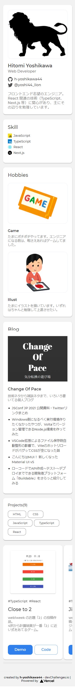

<!-- Please update value in the {}  -->

<h1 align="center">Portfolio</h1>

<div align="center">
   Solution for a challenge from  <a href="http://devchallenges.io" target="_blank">Devchallenges.io</a>.
</div>

<div align="center">
  <h3>
    <a href="https://ch-portfolio.vercel.app/">
      Demo
    </a>
    <span> | </span>
    <a href="https://devchallenges.io/solutions/FXqFVnJSWiGwUVT1RHb6">
      Solution
    </a>
    <span> | </span>
    <a href="https://devchallenges.io/challenges/5ZnOYsSXM24JWnCsNFlt">
      Challenge
    </a>
  </h3>
</div>

<!-- TABLE OF CONTENTS -->

## Table of Contents

- [Table of Contents](#table-of-contents)
- [Overview](#overview)
  - [Desktop](#desktop)
  - [Mobile](#mobile)
  - [Built With](#built-with)
- [Features](#features)
- [How To Use](#how-to-use)
- [learned/improved](#learnedimproved)
- [Acknowledgements](#acknowledgements)
- [Contact](#contact)

<!-- OVERVIEW -->

## Overview
### Desktop


### Mobile


### Built With

<!-- This section should list any major frameworks that you built your project using. Here are a few examples.-->

Base
- [Node.js](https://nodejs.org/)：18.17.1
- [TypeScript](https://www.typescriptlang.org/)：4.5.2
- [React](https://reactjs.org/)：17.0.2
- [Next.js](https://nextjs.org/)：12.0.4

Other major libraries
- [emotion](https://emotion.sh/)
- [csx](https://typestyle.github.io/#/colors)
- [focus-visible](https://github.com/WICG/focus-visible)
- [rss-parser](https://github.com/rbren/rss-parser)

## Features

<!-- List the features of your application or follow the template. Don't share the figma file here :) -->

This application/site was created as a submission to a [DevChallenges](https://devchallenges.io/challenges) challenge. The [challenge](https://devchallenges.io/challenges/5ZnOYsSXM24JWnCsNFlt) was to build an application to complete the given user stories.

- [x] User story: I can see personal details
- [x] User story: I can see skills
- [x] User story: I can see projects
- [x] User story: I can filter projects by tag
- [x] User story: I can see hobbies or certificates
- [ ] User story (optional): I can see experiences
- [x] User story (optional): I can see blogs
- [x] User story (optional): I can see projects on different pages

## How To Use

<!-- Example: -->

To clone and run this application, you'll need [Git](https://git-scm.com) and [Node.js](https://nodejs.org/en/download/) (which comes with [npm](https://www.npmjs.com/)) installed on your computer. From your command line:

```bash
# Clone this repository
git clone https://github.com/h-yoshikawa44/ch-portfolio.git
or
git clone git@github.com:h-yoshikawa44/ch-portfolio.git

# Install dependencies
npm install

# Run the app
npm run dev
```

## learned/improved
- I figured out how to build a card layout with flexbox and negative margins.
- It turns out that RSS information can be handled as JS objects using rss-parser.

## Acknowledgements

<!-- This section should list any articles or add-ons/plugins that helps you to complete the project. This is optional but it will help you in the future. For example: -->

- [Flexboxとネガティブマージンでカード型レイアウトを実装する方法！](https://moshashugyo.com/media/flexbox-negative-margin)

## Contact

- Website：[h-yoshikawa44.com](https://h-yoshikawa44.com)
- GitHub：[@h-yoshikawa44](https://github.com/h-yoshikawa44)
- Twitter：[@yoshi44_lion](https://twitter.com/yoshi44_lion)
